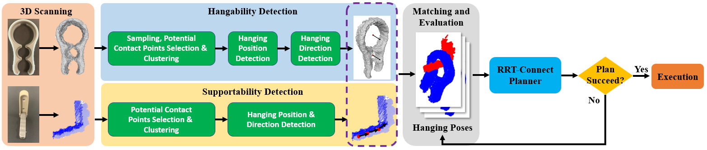

# I Get the Hang of It!

## Author
Wanze Li, Lexin Pan, Boren Jiang, Yuwei Wu, Weixiao Liu, Gregory S. Chirikjian

National University of Singapore, Johns Hopkins University

## Abstract
The action of hanging previously unseen objects remains a challenge for robots due to the multitude of object shapes and the limited number of stable hanging arrangements. This paper proposes a learning-free framework that enables robots to infer stable relative poses between the object being hung (object) and the supporting item (supporter). Our method identifies potential hanging positions and orientations on previously unseen supporters and objects by analyzing the hanging mechanics and geometric properties. An evaluation policy is designed to match potential hanging positions and directions and to optimize the relative hanging poses. Experiments were conducted in both simulation and real-world scenarios. The success rates of our strategy outperform the state-of-the-art baseline method. The proposed method was also tested on unhangable pairs of objects and supporters and results show that our algorithm can reject false positive hanging properly. Finally, we ran experiments under different scanning conditions. Experimental results indicate that although the success rate decreases as the quality of the scan decreases, it remains at a high level. 

## Links
- [Supplementary Material](https://drive.google.com/file/d/1tSElpLl2EzayE5S0DUzYzR152mxgmB0A/view?usp=sharing)
- [Video](https://drive.google.com/file/d/1oauboZ12CiVgnD7ye9s5YguNfSOyS-Ij/view?usp=sharing)
- Code and data will be available soon
